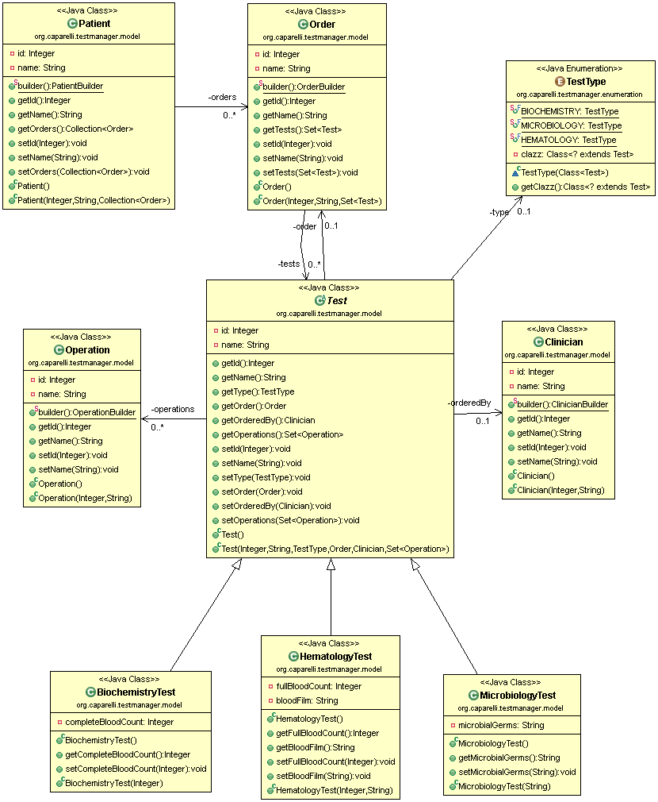

# test-manager
Test Manager Module - Laboratory Information System (LIS)

## Entities
- Test
	- testId: Number
	- orderedBy: Clinician 
	- type: TestType
	- has a set of Operations
- Order
	- orderId: Number
	- has a set of Tests
- Operation
	- is a calculation
- Patient
	- has a collection of Orders
- Clinician / Doctor
- TestType (enum): values = BIOCHEMISTRY, MICROBIOLOGY, HEMATOLOGY

## Business Case

### Description
A Laboratory Information System (LIS) is a software which responsibility is providing a set of interfaces and tools for lab technicians to perform their day to day tasks in a Clinical Laboratory.

Usually patients go to the hospital (or primary care center) for sample (e.g. blood) collection. 

The sample depending on the sample type is placed in a container (e.g. a tube for blood or Serum) and the container is labeled for ensuring the proper assignation to the patient. 

Once te container with the sample arrives to the laboratory, it is registered in the LIS as an Order which contains the collection of Tests (glucose, sodium, hemoglobin, etc) to be performed on a Patient's sample (those tests were previously *"ordered"* by a clinician to the patient). 

Tests can be of different types, for instance: 
- **Biochemistry**
- **Microbiology**
- **Hematology** 

A Test has a set of common properties, plus specific properties depending on the test type. 

Also different operations can be applied over Tests of a given Order, and the same type of operation (e.g. a calculation) can vary based on the type of tests.

These operations are managed by the **"Test Manager Module"**.

Stakeholders might ask to add new type of operations to be performed over the tests of an order, so the system should be flexible to add new operation types, which as said before, might differ depending on the test type. 

## Challenge 

Currently the LIS is a legacy monolithic application. The **"Test Manager Module"**, responsible for applying operations over tests of an order is designed and developed following a procedural style and lacks of maintainability and extensibility.

This part of the application is core for ensuring new features requests by the customers can be implemented with quality and without compromising the delivery.

## Instructions

Your task as Development Architect is defining a refactoring strategy of the Test Manager Module, to ensure:

- **Extensibility**: New operations can be added without needing to change the core of the application. The same operation type might be different depending on the test type.
- **Maintainability**: Developers can easily add new operations to be applied over the tests of an order.

Following **deliverables** should be provided:

- UML diagram(s) of the **"Test Manager Module"**
	-- Properties / parameters of Entities are not relevant. (i.e. for properties use generic names (e g. propA, propB, propC...))
	-- Properties data type are not relevant (i.e. you can use primitive types)
- High level refactoring strategy (e.g. what taskss should be performed before, during and after the refactoring)
- Rationale of:
	-- Proposed project structure.
	-- Design patterns used.
- Skeleton of the **"Test Manager Module"** using your preferred programming language / technology. Source code shall compile and be executed using tests
	-- You do not need to implement real operations, it is enough with mocking two or three operation types.
	-- The source code should be placed in a git repository (e.g. GitHub)